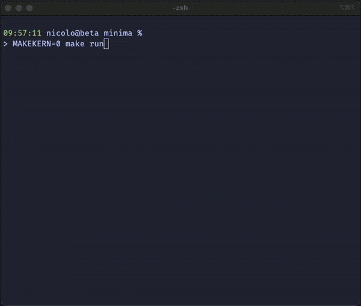

<div>
    <p align="center"></p>
    <h1 align="center">Minima</h1>
</div>

An ultra-minimalistic [Linux distribution](https://en.wikipedia.org/wiki/Linux_distribution) built from scratch in Rust! 🔥

**The goal of the system:**
- Build a [userland](https://en.wikipedia.org/wiki/User_space_and_kernel_space) environment for the Linux kernel
- Depend only on [musl](https://musl.libc.org)
- Neatly package everything for [QEMU](https://en.wikipedia.org/wiki/QEMU) and [Docker](https://en.wikipedia.org/wiki/Docker_(software))

**What is outside of the scope?** - in the short-term
- implement [libc](https://en.wikipedia.org/wiki/C_standard_library)
- implement a kernel
- implement drivers

## Status
I have unfortunately abandoned this project due to loss of interest. This repository will remain public for reference purposes. **The skeleton of the project is still interesting and a good jumping off point for anybody interested!** It builds an ultra-minimal Linux Kernel (~10MB!), root file-system and packages in some userland programs written in rust.

Initially, I was very intrigued by the challenge, it seemed like a good way to learn how Linux works. However, I discovered that **including a standard library removes too much of the challenge**. It does not make it trivial, but not as challenging. Programs like `ls` would just be wrappers around `fs::read_dir(directory)`. Implementing a standard library is a completely different beast. Perhaps something for the future! 

## Getting started
To run the operating system in QEMU run the following command:
```bash
make run
```


## Contribute
Feel free to contribute to any part of this project! If you are unsure where to start, check out the [open issues](https://github.com/ridulfo/minima/issues).

Any amount of help or feedback is appreciated. 🙏
